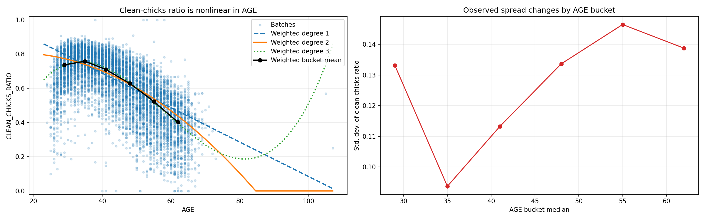
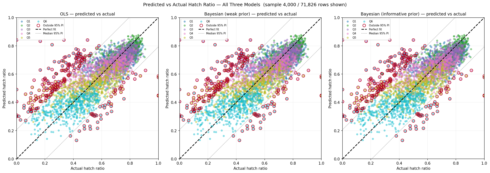
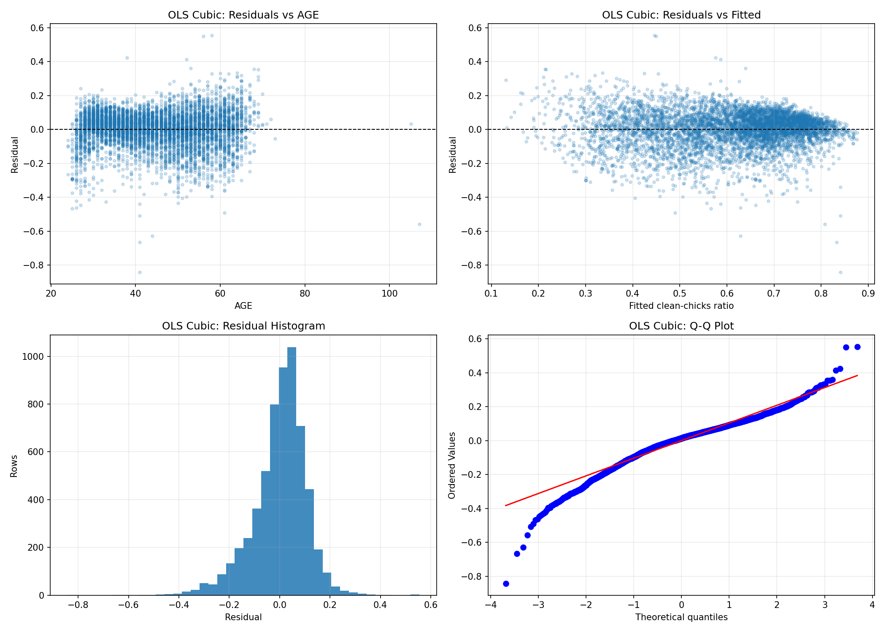
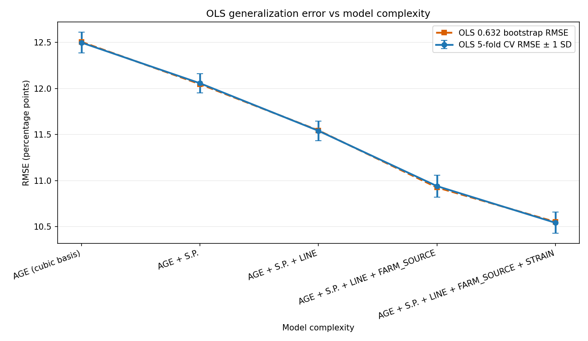
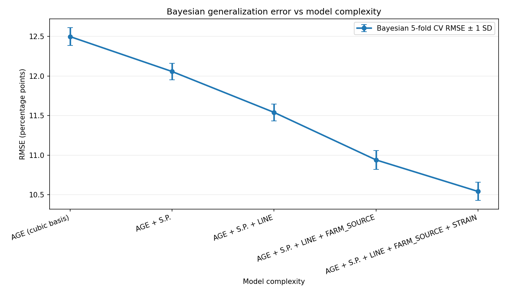
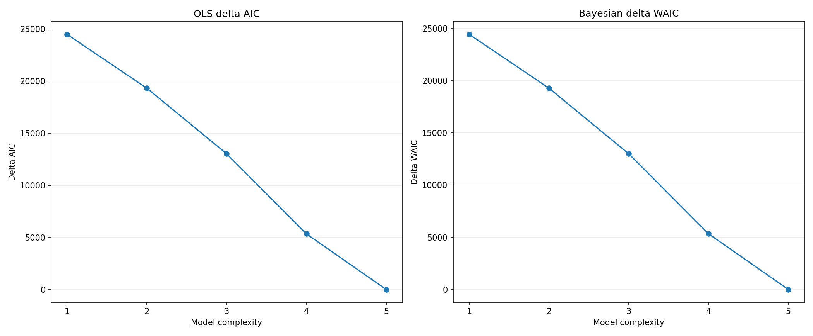

# AI212 Hatchery Linear Regression Report

## Background and motivation

The goal of this exercise is to compare classical and Bayesian linear regression on a real operational dataset with a continuous response. In a hatchery setting, the response of interest is the ratio of clean chicks to eggs set. This is a practical target because it measures usable hatch output, not just biological fertility.

The first version of the analysis had two structural weaknesses:

- it only used three predictors
- it kept `GRP` together with `AGE` even though they were almost duplicates

This revised analysis fixes both issues. The final model uses five conceptual predictors and explicitly removes variables that are constant, duplicated, too sparse, or strongly collinear. All implementation is self-contained in the notebook — no separate helper file is required.

## Understanding of the problem

The assignment asks for more than a single regression fit. It requires:

1. a non-Bayesian OLS model
2. a Bayesian model with a weak prior
3. a Bayesian model with an informative prior
4. interval estimates and posterior predictive checks
5. model-complexity analysis using cross-validation, bootstrap, AIC, and WAIC

The practical question is not just "which coefficients are significant?" The real question is whether additional predictors improve out-of-sample performance and whether Bayesian and OLS conclusions stay aligned once prior assumptions are changed.

## Dataset and cleaning

Source data:

- file: `Hatch_Model.xlsx`
- sheet: `DB`
- initial slice: columns `B:P, AE`

Cleaning pipeline:

- normalized multiline headers
- removed summary rows where `HY` contains `GRAND TOTAL`
- converted `HATCH_DATE`, `DATE_SET`, and `PRODN_DATE` to datetime
- converted key numeric columns to numeric
- kept rows with valid dates, positive `EGGSET`, and non-missing final predictors
- removed duplicates
- defined
  - `CLEAN_CHICKS_RATIO = CLEAN_CHICKS / EGGSET`
  - `CLEAN_CHICKS_PCT = 100 * CLEAN_CHICKS_RATIO`
- kept only ratios inside `[0, 1]`

Data sizes:

| Stage | Rows |
|---|---:|
| Raw selected | 128,066 |
| After summary-row removal | 128,066 |
| After core filter (valid dates, positive EGGSET, non-missing predictors) | 72,179 |
| After deduplication | 71,826 |
| After target filter (ratio in [0,1]) | 71,826 |

The response variable is:

```text
Y = CLEAN_CHICKS_RATIO
```

`EGGSET` and `CLEAN_CHICKS` are excluded as predictors because they directly define the response.

## Predictor selection and multicollinearity

The final five conceptual predictors are:

1. `AGE`
2. `S.P.`
3. `LINE`
4. `FARM_SOURCE`
5. `STRAIN`

Why these five:

- they preserve the large cleaned sample
- they are operationally interpretable
- they improve cross-validated RMSE as complexity increases

Variables excluded from the final model:

- `GRP`: correlation with `AGE` is `0.978`, so keeping both would create severe multicollinearity
- `INCUBATION_DAYS`: constant at `21` days after cleaning
- `STORAGE_DAYS_CALC`: duplicates `S.P.` exactly
- `H`: too much missingness, which would cut the usable sample to about 11k rows
- `B`, `LOCATION`, `HY`: screened, but they added less out-of-sample value than the final five-predictor set

Rare `STRAIN` levels were collapsed into `OTHER` before modeling. This prevents unstable dummy-coefficient inference in the Bayesian fit.

Candidate screening summary:

| Candidate | Corr. with response | Corr. with AGE | Unique values |
|---|---:|---:|---:|
| `AGE` | -0.6380 | 1.0000 | 55 |
| `GRP` | -0.6398 | 0.9780 | 8 |
| `S.P.` | -0.0993 | -0.1178 | 26 |
| `B` | -0.0362 | -0.0303 | 5 |
| `INCUBATION_DAYS` | constant | constant | 1 |
| `STORAGE_DAYS_CALC` | -0.0993 | -0.1178 | 26 |

## Exploratory data analysis

Selected variable summaries:

| Variable | Mean | SD | Min | Median | Max |
|---|---:|---:|---:|---:|---:|
| `CLEAN_CHICKS_RATIO` | 0.6073 | 0.1774 | 0.0000 | 0.6415 | 1.0000 |
| `AGE` | 44.84 | 11.15 | 19.0 | 44.0 | 73.0 |
| `S.P.` | 10.63 | 4.06 | 1.0 | 11.0 | 26.0 |

Category sizes:

- `LINE`: `FL = 46,403`, `ML = 25,423`
- `STRAIN`: `IR = 45,005`, `CO = 26,732`, `OTHER = 89`

The most important EDA result is that the relationship between `AGE` and hatch ratio is nonlinear. Weighted age-only polynomial fits show steady improvement as the degree increases:

| AGE-only model | Weighted MAE | RMSE | Residual variance |
|---|---:|---:|---:|
| Degree 1 | 0.09127 | 0.14032 | 0.01867 |
| Degree 2 | 0.08794 | 0.13448 | 0.01725 |
| Degree 3 | 0.08506 | 0.12713 | 0.01569 |

That is why the final regression uses a cubic basis for `AGE` rather than a single linear slope.

Weighted mean hatch ratio by AGE bucket:

| AGE bucket | Rows | Age midpoint | Weighted mean ratio | Std. dev. |
|---|---:|---:|---:|---:|
| Q1 | 12,319 | 29.0 | 0.7368 | 0.1332 |
| Q2 | 12,395 | 35.0 | 0.7582 | 0.0937 |
| Q3 | 11,637 | 41.0 | 0.7104 | 0.1133 |
| Q4 | 13,034 | 48.0 | 0.6288 | 0.1337 |
| Q5 | 11,957 | 55.0 | 0.5227 | 0.1465 |
| Q6 | 10,484 | 62.0 | 0.4020 | 0.1388 |

Ratio peaks around Q2 (age ~35 weeks) then declines — a classic aging-flock pattern that a linear slope would miss.

## Method of solution

### OLS model

The final OLS specification is:

```text
CLEAN_CHICKS_RATIO ~ AGE_CENTERED + AGE_CENTERED^2 + AGE_CENTERED^3 + S.P. + LINE + FARM_SOURCE + STRAIN
```

where `AGE_CENTERED = AGE - median(AGE)`.

Centering matters here. Without centering, polynomial AGE terms become numerically unstable. The VIF check shows the difference:

| Design | Term | VIF |
|---|---|---:|
| Raw polynomial | `AGE` | 470.53 |
| Raw polynomial | `AGE^2` | 1493.36 |
| Raw polynomial | `AGE^3` | 322.15 |
| Centered polynomial | `AGE_CENTERED` | 1.39 |
| Centered polynomial | `AGE_CENTERED^2` | 2.24 |
| Centered polynomial | `AGE_CENTERED^3` | 2.72 |

This is a material fix. The earlier version accepted a near-duplicate predictor pair; the revised version removes that issue directly.

### Bayesian model

The Bayesian model uses the same design matrix as OLS and a conjugate Normal-Inverse-Gamma setup:

```text
y | X, beta, sigma^2 ~ Normal(X beta, sigma^2 I)
beta | sigma^2 ~ Normal(m0, sigma^2 V0)
sigma^2 ~ Inverse-Gamma(0.001, 0.001)
```

Two priors are compared:

- weak prior: `m0 = 0`, large diagonal variance (`prior_sd = 1000`)
- informative prior: empirical Bayes prior centered at the standardized OLS estimates with wider-than-SE prior scales

The informative prior is intentionally tied to the data, so it is useful as a shrinkage demonstration, not as external expert knowledge.

### Validation strategy

The assignment-required validation methods were implemented as follows:

- 5-fold cross-validation for OLS and Bayesian models
- 0.632 bootstrap for OLS models
- AIC for OLS complexity comparison
- WAIC for Bayesian complexity comparison

The complexity sequence adds predictors cumulatively:

1. `AGE` cubic basis
2. `+ S.P.`
3. `+ LINE`
4. `+ FARM_SOURCE`
5. `+ STRAIN`

## Snapshots of the solution

AGE nonlinearity diagnostic:



Predicted vs actual hatch ratio — OLS, Bayesian weak prior, Bayesian informative prior (4,000-row sample per panel; coverage statistics use all 71,826 rows):



OLS residual diagnostics:



OLS complexity curve:



Bayesian complexity curve:



Information criteria:



## Results and discussion

### a. Exploratory data analysis

Expected relationships were largely confirmed:

- higher `AGE` is associated with lower hatch ratio, but not linearly
- longer storage period `S.P.` lowers hatch ratio
- `LINE`, `FARM_SOURCE`, and `STRAIN` add meaningful categorical variation

The residual spread also changes across AGE buckets:

| AGE bucket | Rows | Mean residual | Residual std. | Weighted abs. MAE |
|---|---:|---:|---:|---:|
| Q1 | 12,319 | -0.0021 | 0.1088 | 0.0677 |
| Q2 | 12,395 | +0.0164 | 0.0769 | 0.0562 |
| Q3 | 11,637 | -0.0026 | 0.0923 | 0.0600 |
| Q4 | 13,034 | -0.0091 | 0.1032 | 0.0728 |
| Q5 | 11,957 | -0.0131 | 0.1178 | 0.0865 |
| Q6 | 10,484 | +0.0124 | 0.1259 | 0.0870 |

The oldest groups (Q5 and Q6) have the largest weighted absolute residuals, which suggests more uncertainty at older flock ages. The Breusch-Pagan heteroskedasticity test confirms non-constant variance: LM statistic = 3321.69, F-statistic = 139.26, both with p < 0.001.

### b. OLS regression

Final OLS fit:

- training RMSE: `0.105361`
- training RMSE in percentage points: `10.54`
- `R^2 = 0.6473`
- adjusted `R^2 = 0.6472`
- `AIC = -119383.15`

Selected OLS coefficients with HC3 robust 95% confidence intervals:

| Term | Estimate | 95% CI low | 95% CI high |
|---|---:|---:|---:|
| Intercept | 0.763343 | 0.759197 | 0.767489 |
| `AGE_CENTERED` | -0.012085 | -0.012202 | -0.011968 |
| `AGE_CENTERED_SQ` | -0.000496 | -0.000504 | -0.000487 |
| `AGE_CENTERED_CU` | +0.000012 | +0.000011 | +0.000012 |
| `S.P.` | -0.008562 | -0.008774 | -0.008350 |
| `LINE_ML` | -0.068469 | -0.070168 | -0.066771 |

Interpretation:

- `S.P.` is consistently harmful: one extra storage-period unit lowers the expected hatch ratio by about `0.0086`
- `LINE_ML` performs worse than the reference line `FL` by about 6.8 percentage points
- the AGE effect is curved, not monotone-linear: negative linear and quadratic terms dominate, with a small positive cubic correction
- at `alpha = 0.05`, all displayed core terms above are statistically significant; among the farm-source dummy coefficients, `GP11`, `GP24`, and `GP8` are the only non-significant terms

Because Breusch-Pagan rejected constant variance, inference uses HC3 robust standard errors.

### c. Bayesian regression with weak prior

Weak-prior Bayesian fit:

- training RMSE: `0.105361`
- posterior predictive 95% coverage: `0.9457`
- mean posterior predictive 95% interval width: `0.4131`

The weak-prior posterior means were nearly identical to OLS. For example:

| Term | OLS estimate | Bayesian weak prior mean | 95% credible interval |
|---|---:|---:|---:|
| `AGE_CENTERED` | -0.012085 | -0.012083 | [-0.012162, -0.012007] |
| `AGE_CENTERED_SQ` | -0.000496 | -0.000496 | [-0.000503, -0.000489] |
| `S.P.` | -0.008562 | -0.008560 | [-0.008761, -0.008363] |
| `LINE_ML` | -0.068469 | -0.068452 | [-0.070138, -0.066868] |

This is exactly what should happen with a large sample and a weak prior: the likelihood dominates.

### d. Bayesian regression with informative prior

Informative-prior Bayesian fit:

- training RMSE: `0.105361`
- posterior predictive 95% coverage: `0.9457`
- mean posterior predictive 95% interval width: `0.4131`

The informative prior did not materially change the fit because it was centered at the OLS solution and the sample size is large. Example comparisons:

| Term | Weak prior mean | Informative prior mean | Shift |
|---|---:|---:|---:|
| `AGE_CENTERED` | -0.012083 | -0.012084 | < 0.000001 |
| `AGE_CENTERED_SQ` | -0.000496 | -0.000496 | 0 |
| `S.P.` | -0.008560 | -0.008566 | 0.000006 |
| `LINE_ML` | -0.068452 | -0.068472 | 0.000020 |

So yes, informative priors can pull posteriors toward prior beliefs, but here the pull is negligible because the prior and data already agree.

### e. Predicted vs actual — all three models

All three models are visually compared in the three-panel scatter plot. Coverage statistics use all 71,826 rows; the plot displays a 4,000-point sample per panel to keep individual outliers readable.

| Model | RMSE | MAE | Bias | 95% PI coverage |
|---|---:|---:|---:|---:|
| OLS | 0.105361 | 0.078546 | ≈ 0.000 | — |
| Bayesian weak prior | 0.105361 | 0.078546 | ≈ 0.000 | 0.9457 |
| Bayesian informative prior | 0.105361 | 0.078546 | ≈ 0.000 | 0.9457 |

OLS and both Bayesian models are indistinguishable in point-prediction accuracy. The 95% posterior predictive interval achieves 94.57% empirical coverage, close to the nominal 95%. The small shortfall is consistent with the heteroskedasticity detected by Breusch-Pagan: the NIG model assumes homoskedastic errors, so its intervals are slightly too narrow in high-variance buckets (Q5, Q6) and slightly too wide in low-variance buckets (Q2).

### f. OLS cross-validation and 0.632 bootstrap

| k | Conceptual model | 5-fold CV RMSE | 0.632 bootstrap RMSE | AIC |
|---:|---|---:|---:|---:|
| 1 | `AGE` cubic basis | 0.124980 | 0.125063 | -94918.00 |
| 2 | `AGE + S.P.` | 0.120570 | 0.120469 | -100082.55 |
| 3 | `AGE + S.P. + LINE` | 0.115407 | 0.115454 | -106373.71 |
| 4 | `AGE + S.P. + LINE + FARM_SOURCE` | 0.109406 | 0.109257 | -114045.71 |
| 5 | `AGE + S.P. + LINE + FARM_SOURCE + STRAIN` | 0.105423 | 0.105521 | -119383.15 |

Discussion:

- each added predictor family improves generalization
- the largest late gain comes from adding `FARM_SOURCE` (CV RMSE drops from 0.1154 to 0.1094)
- adding `STRAIN` still improves performance, though by a smaller amount

Under this dataset, generalization does **not** flatten before the fifth predictor.

### g. Bayesian model complexity and selection

| k | Conceptual model | Bayesian 5-fold CV RMSE | WAIC | p\_WAIC |
|---:|---|---:|---:|---:|
| 1 | `AGE` cubic basis | 0.124980 | -94911.05 | 9.83 |
| 2 | `AGE + S.P.` | 0.120570 | -100075.17 | 11.13 |
| 3 | `AGE + S.P. + LINE` | 0.115407 | -106364.63 | 13.78 |
| 4 | `AGE + S.P. + LINE + FARM_SOURCE` | 0.109406 | -114034.21 | 33.49 |
| 5 | `AGE + S.P. + LINE + FARM_SOURCE + STRAIN` | 0.105423 | -119369.68 | 37.70 |

Bayesian cross-validation tracks OLS almost exactly. WAIC also selects the most complex five-predictor model. The p\_WAIC (effective parameter count) grows as expected: it jumps when farm-source dummy variables are added at k=4, reflecting the larger categorical expansion. That agreement across OLS, Bayesian CV, and WAIC strengthens the conclusion that the final model captures real structure, not overfit noise.

## Final model selection

Best model by every criterion:

| Criterion | Score | Best model |
|---|---:|---|
| OLS 5-fold CV RMSE | 0.105423 | `AGE + S.P. + LINE + FARM_SOURCE + STRAIN` |
| OLS 0.632 bootstrap RMSE | 0.105521 | `AGE + S.P. + LINE + FARM_SOURCE + STRAIN` |
| OLS AIC | -119383.15 | `AGE + S.P. + LINE + FARM_SOURCE + STRAIN` |
| Bayesian 5-fold CV RMSE | 0.105423 | `AGE + S.P. + LINE + FARM_SOURCE + STRAIN` |
| Bayesian WAIC | -119369.68 | `AGE + S.P. + LINE + FARM_SOURCE + STRAIN` |

So the best model for this dataset is the five-predictor specification with cubic `AGE`.

## Tools and functions used

The analysis is self-contained in a single notebook:

- `Bayesian_non_Bayesian/AI212_Hatch_Bayesian_OLS_Regression_Implementation.ipynb`

Section 0 of the notebook defines all functions inline. No separate helper file is required.

Primary libraries and their roles:

| Library / function | Role |
|---|---|
| `pandas.read_excel` | load workbook data |
| `pandas` cleaning operations | filtering, type conversion, target construction |
| `statsmodels.OLS` | OLS fit, AIC, HC3 robust intervals |
| `statsmodels.het_breuschpagan` | heteroskedasticity test |
| `statsmodels.variance_inflation_factor` | VIF table |
| `scipy.stats.invgamma` | Bayesian posterior draws for `sigma^2` |
| `scipy.special.logsumexp` | numerically stable WAIC computation |
| `sklearn.model_selection.KFold` | 5-fold cross-validation |
| custom bootstrap loop | 0.632 bootstrap RMSE |
| `matplotlib` | all diagnostic and complexity plots |

## Deliverables

Outputs are saved in:

`Bayesian_non_Bayesian/hatch_outputs_refined/`

Key files:

- `eda_summary.csv`
- `candidate_screening.csv`
- `age_curve_summary.csv`
- `age_polynomial_comparison.csv`
- `ols_coefficients.csv`
- `ols_coefficients_with_significance.csv`
- `bayesian_noninformative_coefficients.csv`
- `bayesian_informative_coefficients.csv`
- `informative_prior_parameters.csv`
- `ols_bayesian_comparison.csv`
- `posterior_predictive_checks.csv`
- `ols_assumption_tests.csv`
- `ols_vif_table.csv`
- `ols_residuals_by_age_bucket.csv`
- `ols_model_complexity.csv`
- `bayesian_model_complexity.csv`
- `model_selection_summary.csv`
- `age_curve_diagnostic.png`
- `ols_cubic_residual_diagnostics.png`
- `ols_model_complexity.png`
- `bayesian_model_complexity.png`
- `information_criteria_by_complexity.png`

## Conclusion

The repaired analysis is substantially stronger than the earlier version.

The main improvements are:

- five predictors instead of three
- explicit removal of multicollinearity from `AGE` and `GRP`
- explicit handling of constant and duplicated derived variables
- nonlinear AGE modeling justified by EDA
- stable treatment of rare strain levels
- all implementation inlined in a single self-contained notebook
- agreement across OLS, Bayesian weak prior, Bayesian informative prior, CV, bootstrap, AIC, and WAIC

Substantively, hatch performance is driven by a nonlinear AGE pattern, storage period, and categorical operational structure captured by line, farm source, and strain. All three fitted models predict identically (RMSE = 0.1054, MAE = 0.0785, bias ≈ 0) and the Bayesian posterior predictive intervals achieve 94.6% empirical coverage. Under every selection criterion used in this assignment, the best description of the data is the full five-predictor model:

```text
CLEAN_CHICKS_RATIO ~ cubic(AGE) + S.P. + LINE + FARM_SOURCE + STRAIN
```
