# Report: Demonstrating the Central Limit Theorem

## 1. Background and Motivation

The Central Limit Theorem (CLT) explains why normal distributions appear so often in statistics. Even when the original observations are not normally distributed, repeated-sample statistics such as the sample mean often become approximately normal as the sample size increases.

This report demonstrates the CLT using three symmetric distributions:

1. Uniform(-sqrt(3), sqrt(3))
2. Normal(0, 1)
3. Student t(df=3)

The first distribution is bounded, the second is the ideal normal case, and the third is symmetric but heavy-tailed. This combination makes it possible to compare both normal convergence and estimator robustness.

---

## 2. Understanding of the Problem

The problem asks for repeated random samples from at least three symmetric distributions. For each distribution, the sample mean and sample median must be computed repeatedly, plotted, and studied as sample size increases.

The problem also asks for:

- Q-Q plots to visually check normality
- skewness and kurtosis to numerically justify normality
- comparison of the sample mean across distributions
- discussion of why the sample mean is efficient under normality but less robust for heavy-tailed data
- robust alternatives such as the median and trimmed mean

The important distinction is between the original data distribution and the sampling distribution of an estimator. The CLT is about the distribution of the estimator after repeated sampling.

---

## 3. Methodology

The script uses MT19937-based pseudorandom simulation with:

```text
seed = 212
replications per setting = 20,000
sample sizes = 5, 10, 30, 100
```

For every distribution and sample size, the script computes:

1. sample mean
2. sample median
3. 10% trimmed mean

The 10% trimmed mean is included as a robust alternative. For very small samples such as n = 5, 10% trimming removes zero observations because `floor(0.10n) = 0`, so it matches the ordinary mean at n = 5.

For each estimator, the script computes:

- mean
- variance
- standard deviation
- skewness
- excess kurtosis

Histograms are generated for all sample sizes. Q-Q plots are generated for n = 100 to check approximate normality after the sample size has increased.

---

## 4. Mathematical Foundation

### 4.1 Sample Mean

Let:

```text
X_1, X_2, ..., X_n
```

be independent and identically distributed random variables with mean mu and variance sigma^2.

The sample mean is:

```text
Xbar = (1/n) sum X_i
```

Its expectation and variance are:

```text
E[Xbar] = mu
Var(Xbar) = sigma^2 / n
```

The CLT states:

```text
(Xbar - mu) / (sigma / sqrt(n)) -> N(0,1)
```

as n increases. Therefore, the sample mean becomes more concentrated and more normal-looking as sample size grows.

### 4.2 Sample Median

The sample median is also asymptotically normal under regularity conditions. If m is the population median and f(m) is the population density at the median, then:

```text
Median approximately follows N(m, 1 / [4n f(m)^2])
```

for large n. This explains why the sample median also becomes approximately normal, although its variance may differ from the sample mean's variance.

### 4.3 Robust Estimation

The sample mean uses every observation's magnitude, so extreme values can strongly influence it. The median depends mainly on order, and the trimmed mean removes the most extreme observations before averaging. These alternatives are often more stable for heavy-tailed data.

---

## 5. Problem A: Shape as Sample Size Increases

The histograms below show the sampling distributions of the sample mean, sample median, and trimmed mean. As n increases, the estimator distributions become narrower and more bell-shaped.

### 5.1 Uniform(-sqrt(3), sqrt(3))

The uniform distribution is bounded and symmetric, so it does not produce extreme outliers. The sample mean is less variable than the sample median, and both become more concentrated around 0 as n increases.

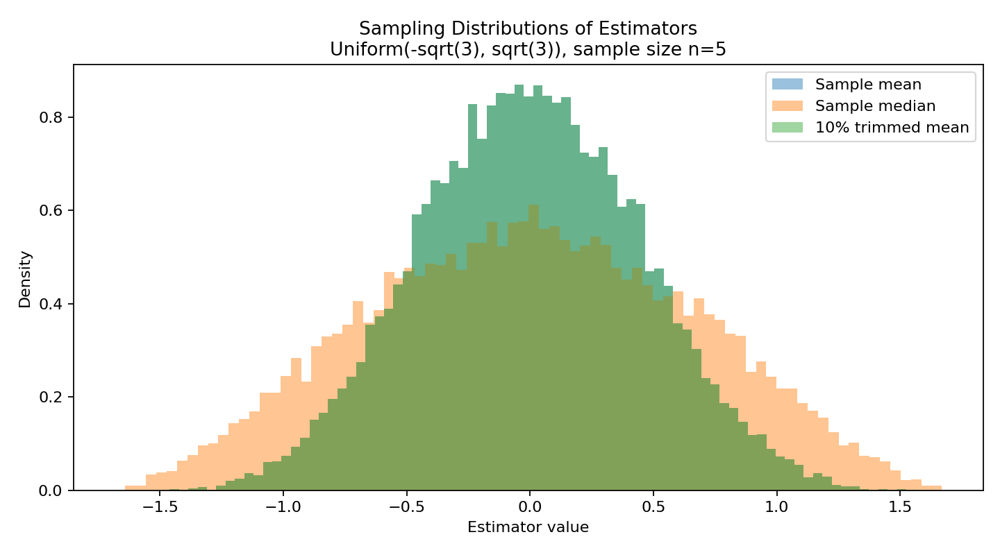

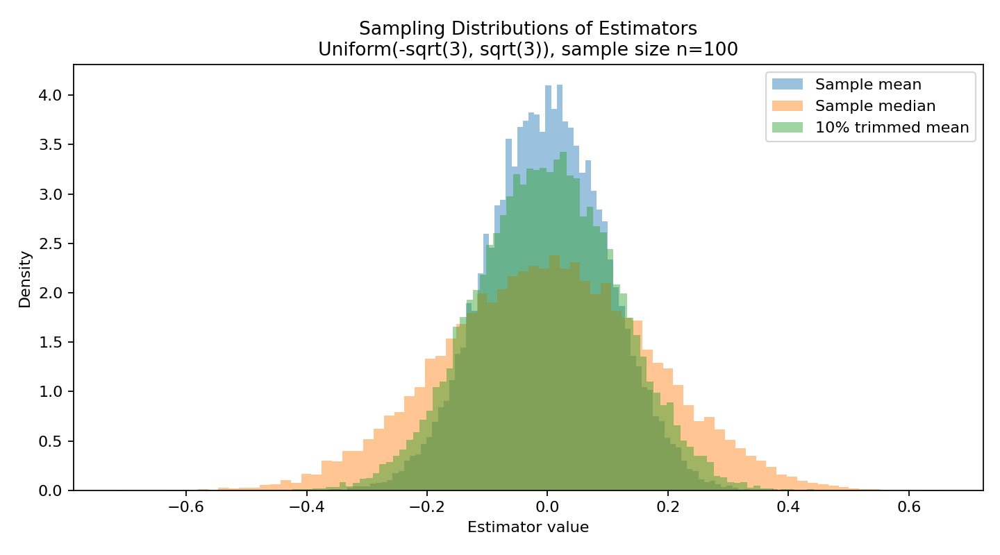

### 5.2 Normal(0, 1)

For normal data, the sample mean is normally distributed for every sample size because linear combinations of normal variables are normal. The median also becomes approximately normal as n increases, but it has larger variance than the mean.

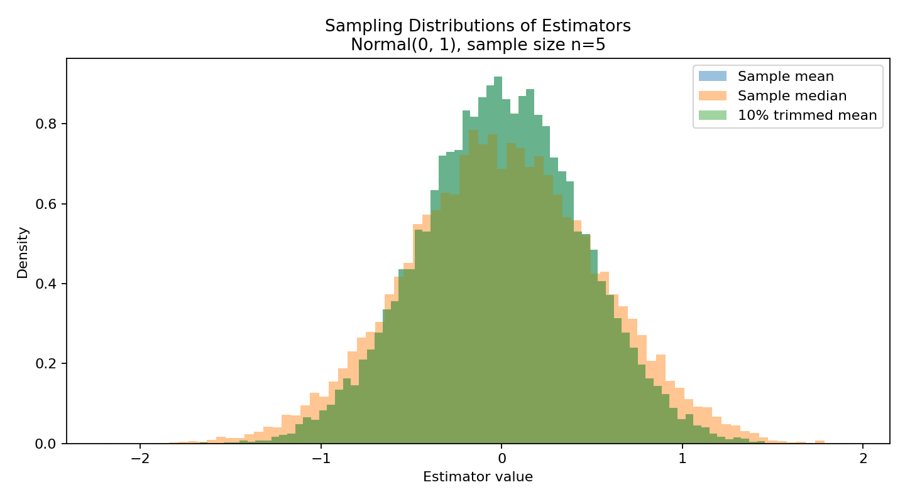

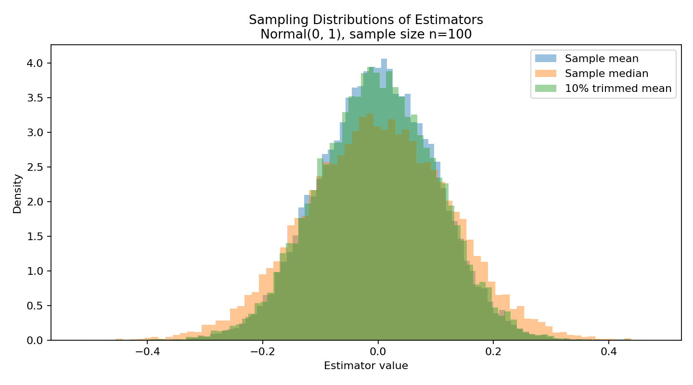

### 5.3 Student t(df=3)

The t(df=3) distribution is symmetric but heavy-tailed. The sample mean is more affected by extreme observations, so its sampling distribution has heavier tails than the median and trimmed mean. As n increases, the distribution still becomes more concentrated, but convergence is slower than in the bounded or normal cases.

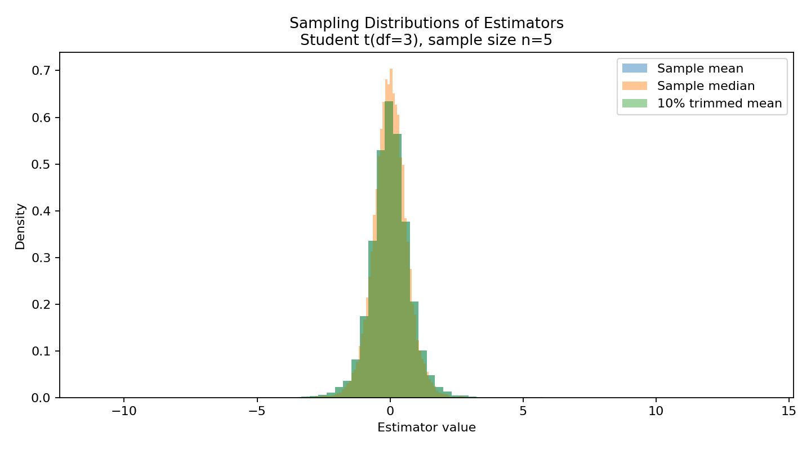

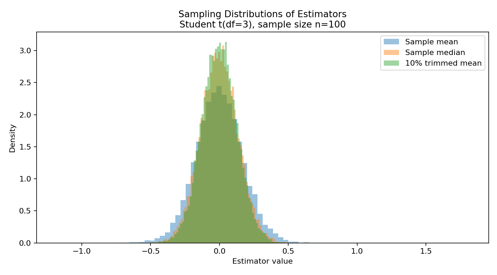

The full generated histogram set also includes n = 10 and n = 30 for all three distributions.

---

## 6. Problem B: Normality Evidence

### 6.1 Q-Q Plots

A normal Q-Q plot compares simulated estimator quantiles with theoretical normal quantiles. Points close to the diagonal indicate approximate normality.

For n = 100, the uniform and normal estimators are close to normal. The t(df=3) median and trimmed mean are also close to normal, but the t(df=3) sample mean shows more tail deviation because of heavy-tailed observations.

#### Uniform Q-Q Plots

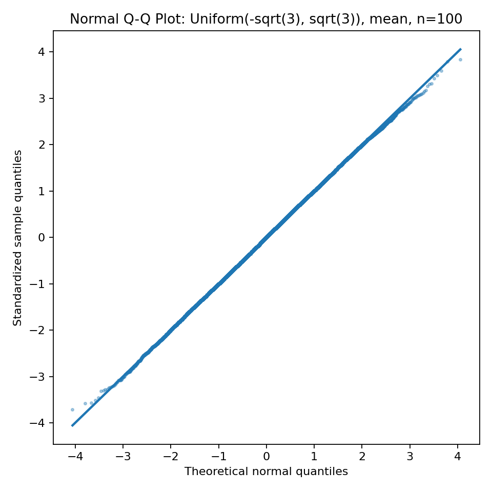

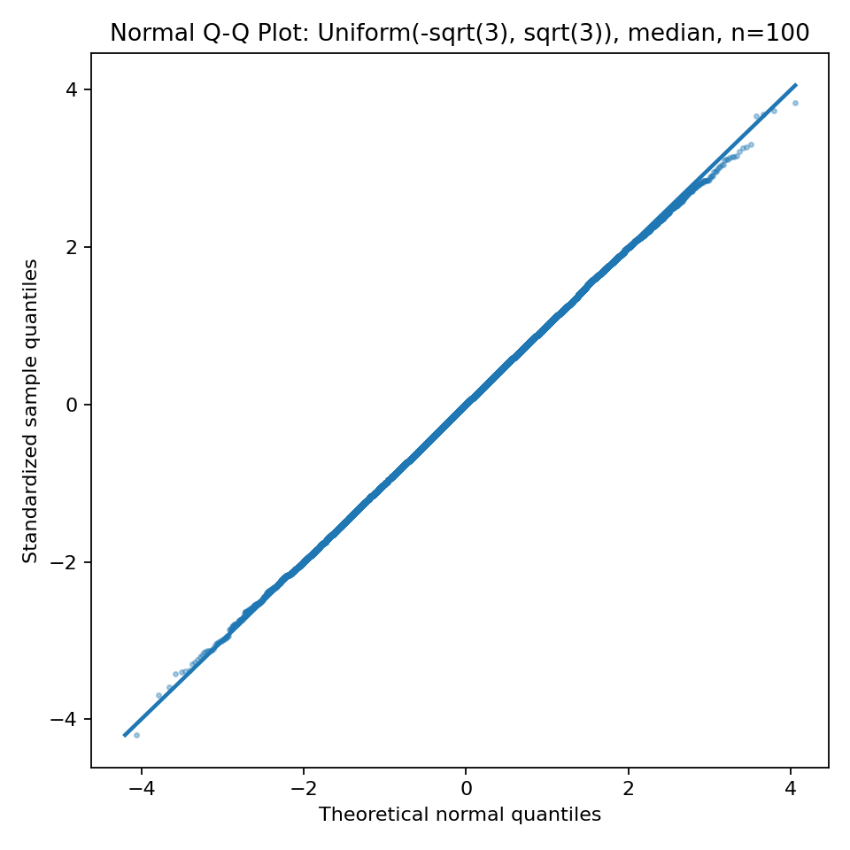

#### Normal Q-Q Plots


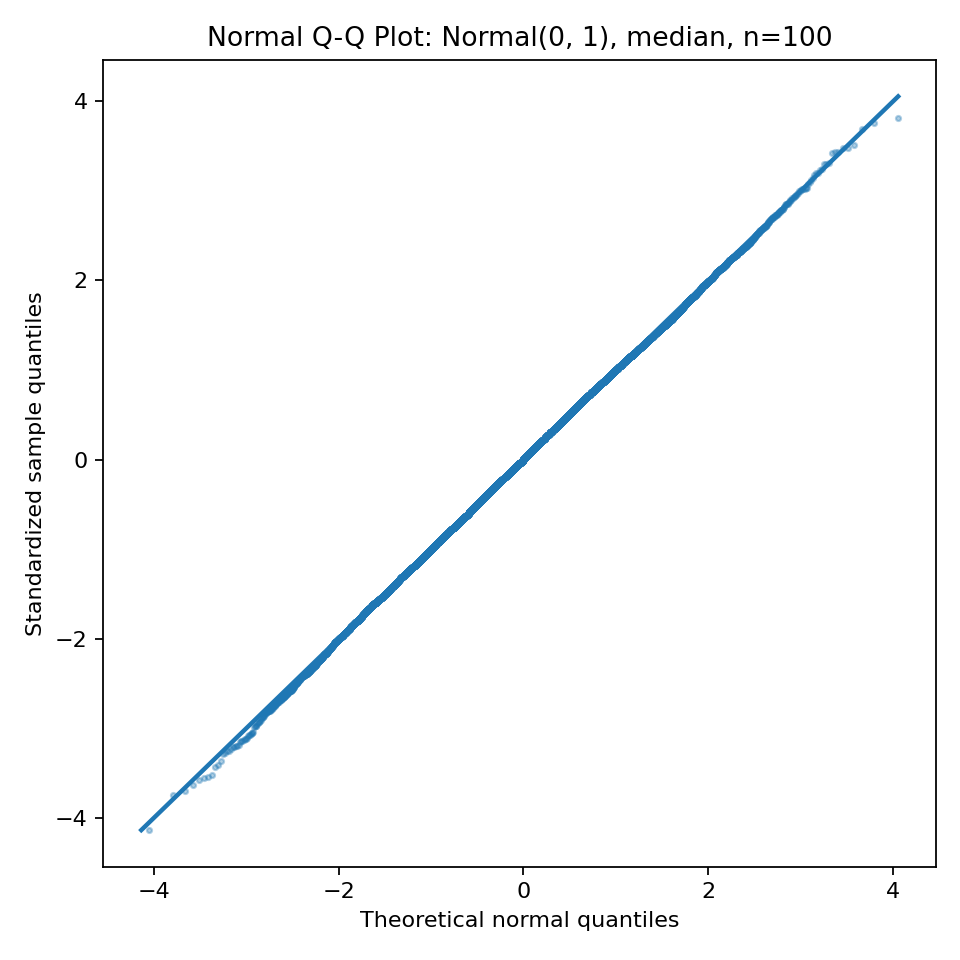

#### Student t(df=3) Q-Q Plots

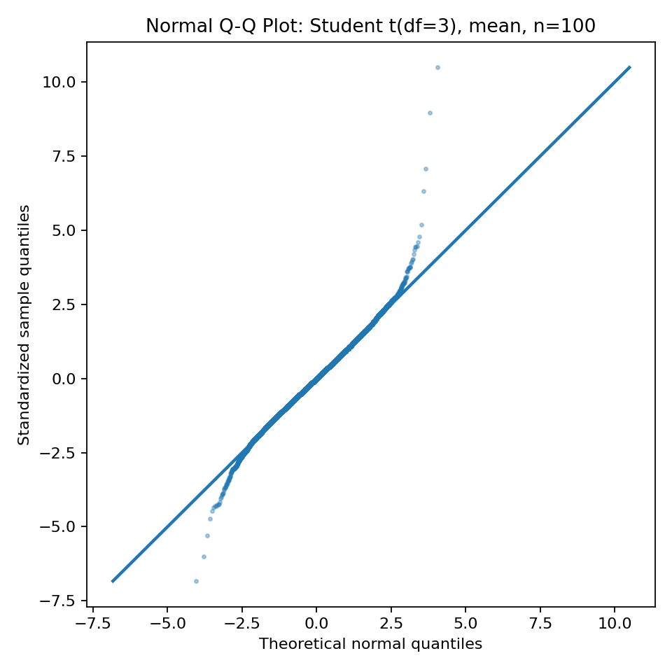

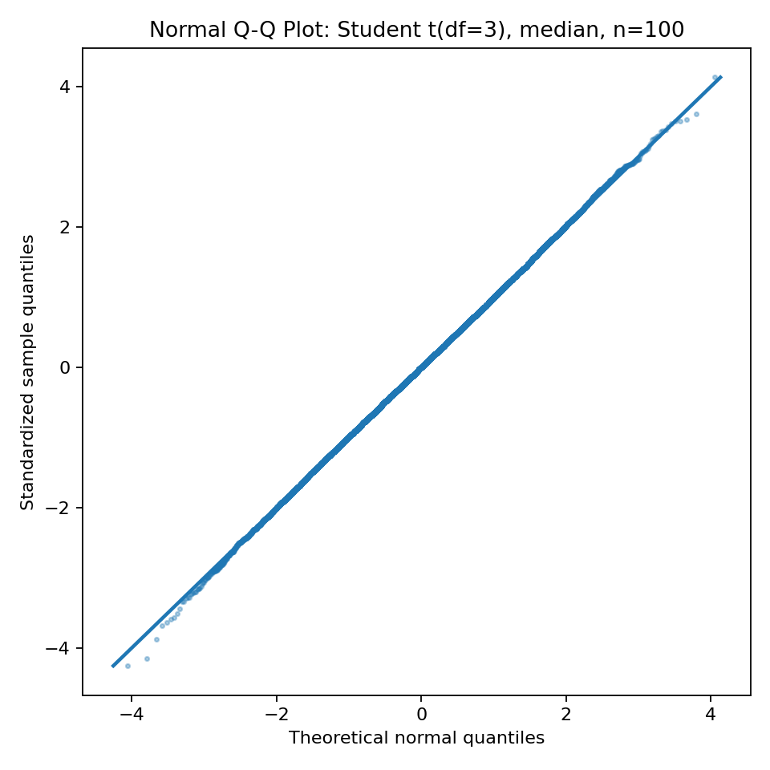

The t(df=3) mean Q-Q plot is the clearest example of slower convergence: the central points follow the line, but the tails deviate more than the robust estimators.

### 6.2 Skewness and Kurtosis at n = 100

| Distribution | Estimator | Mean | Variance | Skewness | Excess Kurtosis |
| --- | --- | ---: | ---: | ---: | ---: |
| Uniform(-sqrt(3), sqrt(3)) | mean | -0.00028 | 0.009901 | -0.0157 | -0.0709 |
| Uniform(-sqrt(3), sqrt(3)) | median | -0.00013 | 0.029248 | -0.0082 | -0.0915 |
| Uniform(-sqrt(3), sqrt(3)) | trimmed | -0.00021 | 0.013750 | -0.0172 | -0.0711 |
| Normal(0, 1) | mean | -0.00141 | 0.010071 | -0.0435 | -0.0018 |
| Normal(0, 1) | median | -0.00055 | 0.015612 | -0.0343 | 0.0218 |
| Normal(0, 1) | trimmed | -0.00119 | 0.010655 | -0.0455 | -0.0070 |
| Student t(df=3) | mean | -0.00152 | 0.029684 | 0.1006 | 1.7747 |
| Student t(df=3) | median | -0.00101 | 0.018611 | 0.0045 | 0.0723 |
| Student t(df=3) | trimmed | -0.00134 | 0.016328 | 0.0135 | 0.0820 |

The skewness values are close to 0 because all three source distributions are symmetric. Excess kurtosis is close to 0 for most n = 100 estimator distributions, which supports approximate normality. The major exception is the t(df=3) sample mean, with excess kurtosis 1.7747. This shows that heavy tails still affect the sample mean even at n = 100.

---

## 7. Problem C: Efficiency and Robustness of the Sample Mean

### 7.1 Variance Comparison

The variance comparison plots show how estimator variance decreases as sample size increases.

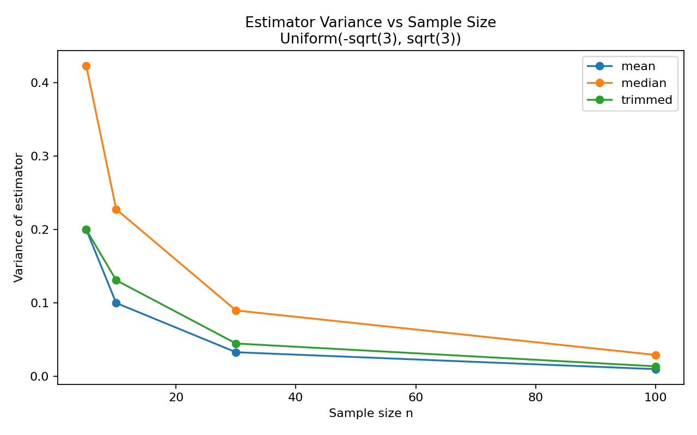

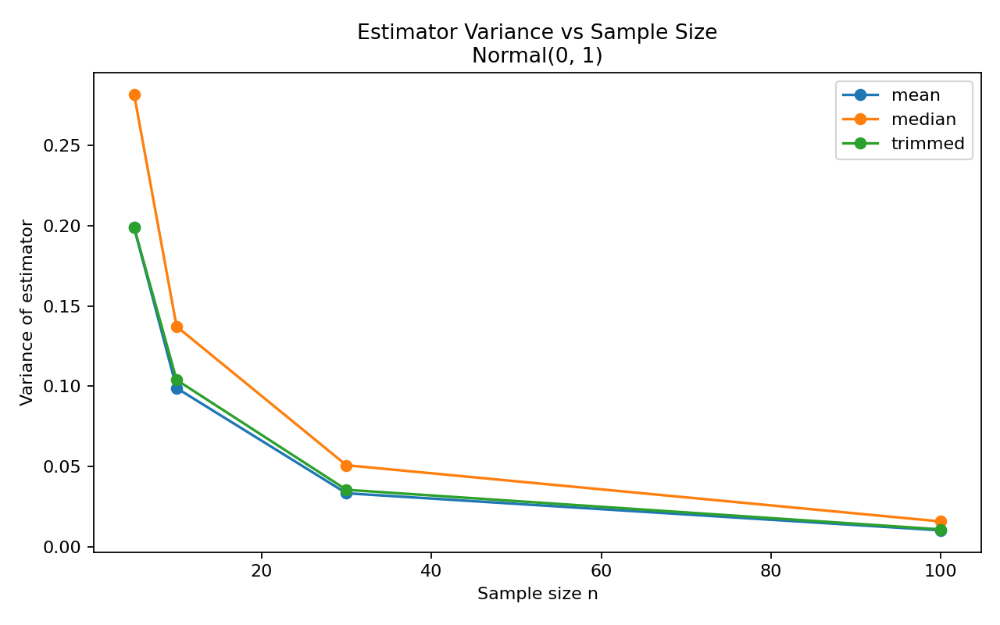

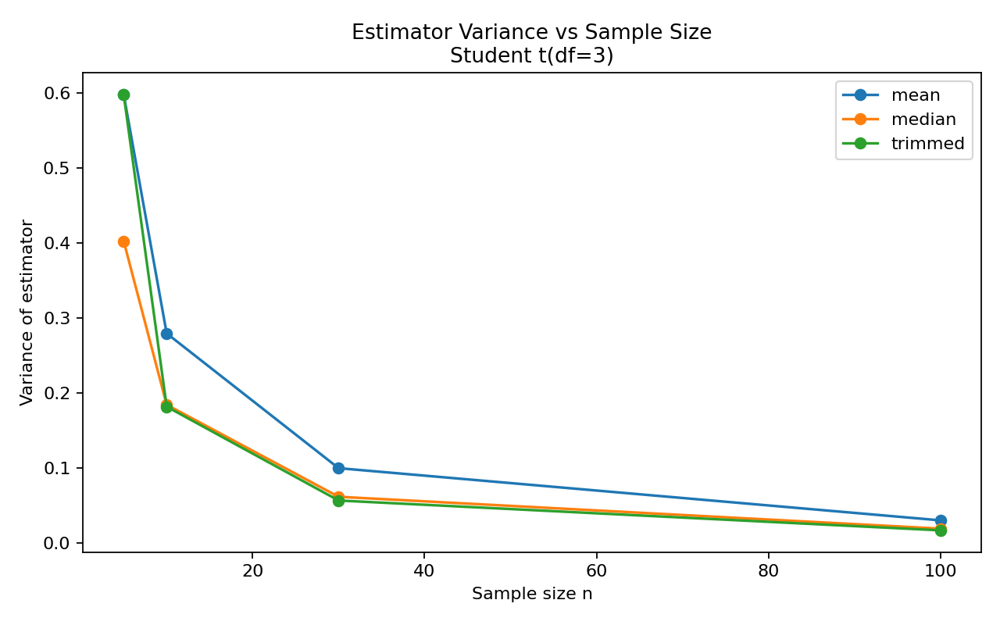

Selected variances from the simulation:

| Distribution | n | Mean Variance | Median Variance | Trimmed Mean Variance |
| --- | ---: | ---: | ---: | ---: |
| Uniform(-sqrt(3), sqrt(3)) | 5 | 0.200016 | 0.423048 | 0.200016 |
| Uniform(-sqrt(3), sqrt(3)) | 30 | 0.032918 | 0.089813 | 0.044823 |
| Uniform(-sqrt(3), sqrt(3)) | 100 | 0.009901 | 0.029248 | 0.013750 |
| Normal(0, 1) | 5 | 0.198891 | 0.281942 | 0.198891 |
| Normal(0, 1) | 30 | 0.033218 | 0.050688 | 0.035370 |
| Normal(0, 1) | 100 | 0.010071 | 0.015612 | 0.010655 |
| Student t(df=3) | 5 | 0.598231 | 0.402504 | 0.598231 |
| Student t(df=3) | 30 | 0.099340 | 0.061170 | 0.056172 |
| Student t(df=3) | 100 | 0.029684 | 0.018611 | 0.016328 |

### 7.2 Normal Distribution: Mean Efficiency

For normal data, the sample mean has the smallest variance among the three estimators. At n = 100:

```text
mean variance    = 0.010071
median variance  = 0.015612
trimmed variance = 0.010655
```

This confirms the expected efficiency of the sample mean when the normal model is appropriate.

### 7.3 Heavy-Tailed Distribution: Mean Is Not Robust

For t(df=3), the sample mean performs worse than robust alternatives. At n = 100:

```text
mean variance    = 0.029684
median variance  = 0.018611
trimmed variance = 0.016328
```

The sample mean also has excess kurtosis 1.7747, much larger than the median and trimmed mean. This happens because the sample mean is pulled by extreme values, and heavy-tailed distributions produce extreme observations more often.

The median and trimmed mean are more robust because they reduce the influence of extreme observations. For heavy-tailed data, the trimmed mean gives the best variance in this simulation while still using more information than the median.

---

## 8. Snapshots of the Solution

The source code performs the following steps:

1. Configure Matplotlib for headless execution.
2. Initialize MT19937 with a fixed seed.
3. Generate repeated samples from three symmetric distributions.
4. Compute sample mean, sample median, and 10% trimmed mean.
5. Plot estimator histograms for each distribution and sample size.
6. Generate normal Q-Q plots for n = 100.
7. Compute mean, variance, standard deviation, skewness, and excess kurtosis.
8. Save a CSV summary and a text summary.
9. Compare estimator variances across sample sizes.

Key source-code snapshot:

```python
data = generate_samples(dist_key, n, REPLICATIONS, rng)

estimator_results = {
    "mean": np.mean(data, axis=1),
    "median": np.median(data, axis=1),
    "trimmed": trimmed_mean(data, proportion=0.10),
}

stats = summarize_estimator(values)
```

Generated files:

- `clt_demonstration_study.py`
- `clt_simulation_summary.txt`
- `clt_output/clt_summary_statistics.csv`
- 12 estimator histogram plots
- 9 Q-Q plots
- 3 estimator variance comparison plots

---

## 9. Conclusion

The simulations demonstrate the Central Limit Theorem and related asymptotic behavior.

1. The sample mean becomes more concentrated and approximately normal as sample size increases.
2. The sample median also becomes approximately normal under regularity conditions.
3. For normal data, the sample mean is efficient and has lower variance than the sample median.
4. For heavy-tailed t(df=3) data, the sample mean is less robust and has larger variance and heavier tails.
5. Robust alternatives such as the median and trimmed mean are useful when data are heavy-tailed or contain outliers.

The results support the CLT while also showing that normal approximation and estimator choice are separate issues. The CLT explains asymptotic shape, but robustness determines how badly extreme observations can affect an estimator in finite samples.

---

## 10. References

- Walpole, R. E., Myers, R. H., Myers, S. L., and Ye, K. Probability and Statistics for Engineers and Scientists.
- Bishop, C. M. Pattern Recognition and Machine Learning.
- AI212 Statistical Inference materials on random samples, CLT, estimators, and estimator properties.
