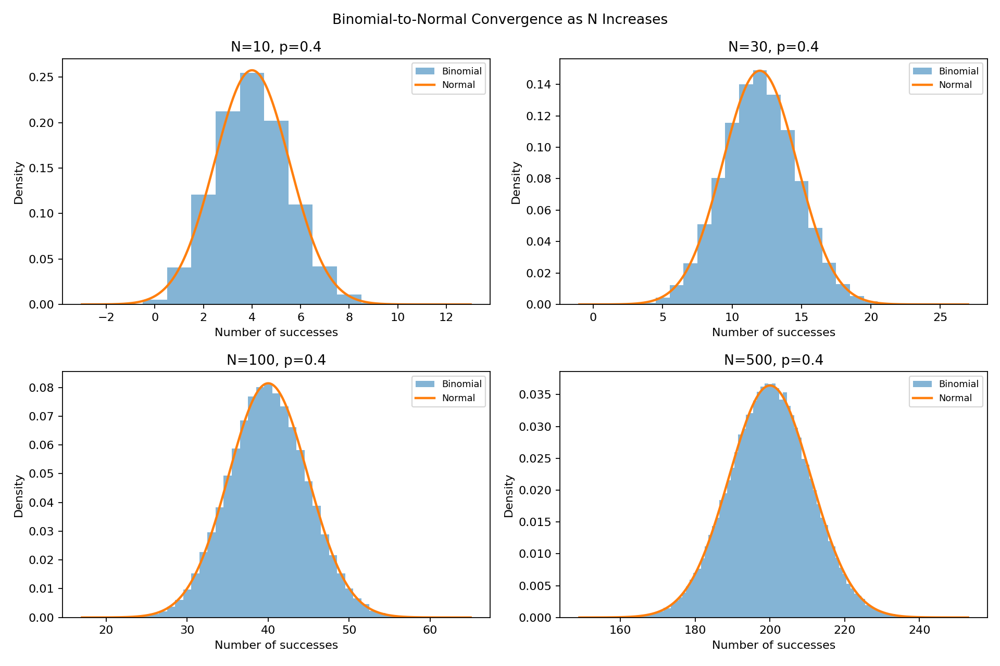
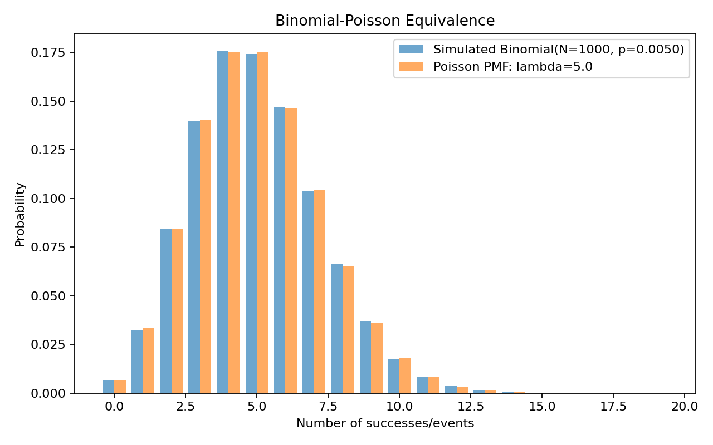
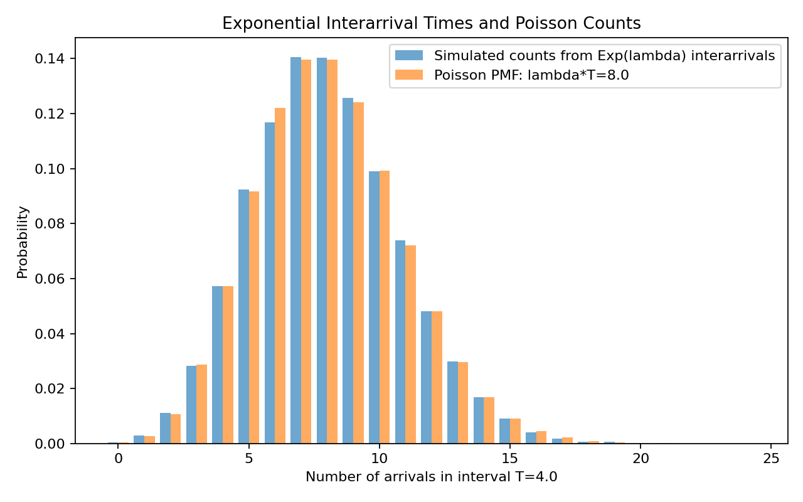

# Report: Equivalence in Distributions

## 1. Background and Motivation

Many probability distributions are connected by limiting relationships or by different views of the same stochastic process. These relationships are important because they explain when a simpler or more convenient distribution can approximate another distribution.

This report studies three equivalences:

1. Binomial and Normal equivalence
2. Binomial and Poisson equivalence
3. Exponential interarrival times and Poisson count equivalence

These results are useful in statistical inference, queueing theory, reliability analysis, simulation, and machine learning. The computational work uses MT19937-based pseudorandom simulation to compare empirical distributions with their corresponding theoretical approximations.

---

## 2. Understanding of the Problem

The problem asks for both mathematical explanation and simulation evidence.

For the binomial-normal relationship, the task is to show that a Bin(N,p) distribution becomes closer to a normal distribution as N increases. The matching normal distribution has mean Np and variance Np(1-p).

For the binomial-Poisson relationship, the task is to show that Bin(N,p) approaches Poisson(lambda) when N is large, p is small, and Np = lambda remains fixed.

For the exponential-Poisson relationship, the task is to show that independent Exp(lambda) interarrival times create Poisson(lambda T) counts over a fixed time interval T.

The simulations should not replace the theory. They should support the theoretical relationships by showing matching histograms, probability masses, and numerical summaries.

---

## 3. Methodology

The source code uses NumPy's `MT19937` bit generator for reproducible pseudorandom simulation. The fixed seed is:

```text
seed = 212
```

The code uses three separate experiments:

1. Generate Bin(N,p) samples for several increasing values of N and overlay the matching normal PDF.
2. Generate Bin(N,p) samples with N large, p small, and Np = lambda, then compare empirical probabilities with the Poisson(lambda) PMF.
3. Generate Exp(lambda) interarrival times, count arrivals by time T, and compare the simulated count distribution with Poisson(lambda T).

The plots use normalized histograms or empirical probability bars so they can be compared directly with theoretical PDFs or PMFs.

---

## 4. Problem A: Binomial and Normal Equivalence

### 4.1 Background

The binomial distribution models the number of successes in a fixed number of independent Bernoulli trials. If N is large and p is not too close to 0 or 1, the binomial distribution has a bell-like shape and can be approximated by a normal distribution.

### 4.2 Mathematical Explanation

Let:

```text
X_N ~ Bin(N,p)
```

A binomial random variable can be written as a sum of independent Bernoulli random variables:

```text
X_N = Y_1 + Y_2 + ... + Y_N
```

where each `Y_i ~ Bernoulli(p)`.

For each Bernoulli trial:

```text
E[Y_i] = p
Var(Y_i) = p(1-p)
```

Therefore:

```text
E[X_N] = Np
Var(X_N) = Np(1-p)
```

By the Central Limit Theorem:

```text
(X_N - Np) / sqrt(Np(1-p)) -> N(0,1)
```

as N increases. Thus:

```text
X_N approximately follows N(Np, Np(1-p))
```

for large N.

### 4.3 Simulation Setup

The simulation uses:

```text
p = 0.40
N = 10, 30, 100, 500
sample size = 100,000 for each N
```

For each N, the script computes:

```text
mu = Np
sigma^2 = Np(1-p)
```

and overlays the corresponding normal PDF.

### 4.4 Results and Discussion



| N | Sample Mean | Theoretical Mean | Absolute Mean Error | Sample Variance | Theoretical Variance | Absolute Variance Error |
| ---: | ---: | ---: | ---: | ---: | ---: | ---: |
| 10 | 4.001790 | 4.000000 | 0.001790 | 2.384591 | 2.400000 | 0.015409 |
| 30 | 11.996440 | 12.000000 | 0.003560 | 7.214319 | 7.200000 | 0.014319 |
| 100 | 39.997770 | 40.000000 | 0.002230 | 24.018625 | 24.000000 | 0.018625 |
| 500 | 199.989520 | 200.000000 | 0.010480 | 119.360124 | 120.000000 | 0.639876 |

The normal approximation improves visually as N increases. For N = 10, the discreteness and slight asymmetry of the binomial distribution are still visible. By N = 100 and N = 500, the empirical histogram is much more bell-shaped and follows the normal PDF closely.

Small differences remain because the binomial distribution is discrete while the normal distribution is continuous. A continuity correction would improve probability calculations, but for visual density comparison the normal overlay already captures the main behavior.

---

## 5. Problem B: Binomial and Poisson Equivalence

### 5.1 Background

The Poisson distribution is often used to model rare-event counts in a fixed interval or region. Examples include defects in a product batch, arrivals in a short time interval, or rare failures in a system.

### 5.2 Limiting Derivation

Start with:

```text
X ~ Bin(N,p)
P(X=k) = C(N,k) p^k (1-p)^(N-k)
```

Assume:

```text
p = lambda / N
```

so that:

```text
Np = lambda
```

Substitute into the binomial PMF:

```text
P(X=k) = C(N,k) (lambda/N)^k (1 - lambda/N)^(N-k)
```

Rewrite the combination:

```text
C(N,k) = N(N-1)...(N-k+1) / k!
```

Then:

```text
P(X=k)
= [lambda^k/k!]
  [N(N-1)...(N-k+1)/N^k]
  (1 - lambda/N)^N
  (1 - lambda/N)^(-k)
```

As N -> infinity:

```text
[N(N-1)...(N-k+1)/N^k] -> 1
(1 - lambda/N)^N -> exp(-lambda)
(1 - lambda/N)^(-k) -> 1
```

Therefore:

```text
P(X=k) -> exp(-lambda) lambda^k / k!
```

This is the Poisson(lambda) PMF. Thus:

```text
Bin(N,p) -> Poisson(lambda)
```

when N is large, p is small, and Np = lambda.

### 5.3 Simulation Setup

The simulation uses:

```text
lambda = 5
N = 1000
p = lambda / N = 0.005
sample size = 100,000
```

The empirical Bin(1000, 0.005) probabilities are compared with Poisson(5).

### 5.4 Results and Discussion



| Quantity | Value |
| --- | ---: |
| Sample mean | 5.015140 |
| Theoretical Poisson mean | 5.000000 |
| Absolute mean error | 0.015140 |
| Sample variance | 5.019201 |
| Theoretical Poisson variance | 5.000000 |
| Absolute variance error | 0.019201 |

The empirical binomial probabilities nearly overlap with the Poisson probabilities. This happens because there are many trials, each trial has a very small probability of success, and the expected number of successes remains fixed at lambda = 5.

The remaining discrepancies are small and are caused by finite simulation size and the fact that N = 1000 is large but not infinite. Tail probabilities are also estimated with less precision because tail events occur rarely.

---

## 6. Problem C: Exponential and Poisson Equivalence

### 6.1 Background

The exponential and Poisson distributions are connected through the Poisson process. The exponential distribution describes waiting times between events, while the Poisson distribution describes the number of events in a fixed interval.

For example, if customer arrivals occur independently at a constant average rate, then waiting times between customers can be modeled as exponential and the number of customers in a fixed time interval can be modeled as Poisson.

### 6.2 Derivation

Let:

```text
W_1, W_2, ..., W_n ~ Exp(lambda)
```

be independent interarrival times. The nth arrival time is:

```text
S_n = W_1 + W_2 + ... + W_n
```

The number of arrivals by time T is:

```text
N(T) = max{n : S_n <= T}
```

Exactly k arrivals occur by time T when the kth arrival has happened but the next one has not:

```text
P(N(T)=k) = P(S_k <= T < S_{k+1})
```

The sum `S_k` of k independent Exp(lambda) variables has an Erlang/Gamma distribution with density:

```text
f_{S_k}(s) = lambda^k s^(k-1) exp(-lambda s) / (k-1)!, s >= 0
```

Conditioning on the kth arrival time `S_k = s`, the probability that no further arrival happens in the remaining time `T-s` is:

```text
P(W_{k+1} > T-s) = exp[-lambda(T-s)]
```

So:

```text
P(N(T)=k)
= integral from 0 to T of f_{S_k}(s) exp[-lambda(T-s)] ds
= integral from 0 to T of [lambda^k s^(k-1) exp(-lambda s)/(k-1)!] exp[-lambda(T-s)] ds
= exp(-lambda T) lambda^k/(k-1)! integral from 0 to T s^(k-1) ds
= exp(-lambda T) lambda^k T^k / k!
= exp(-lambda T) (lambda T)^k / k!
```

For k = 0, the probability is simply no arrivals before T:

```text
P(N(T)=0) = P(W_1 > T) = exp(-lambda T)
```

which also matches the same formula. Therefore:

```text
N(T) ~ Poisson(lambda T)
```

### 6.3 Simulation Setup

The simulation uses:

```text
lambda = 2
T = 4
lambda T = 8
number of repeated intervals = 50,000
```

For each repeated interval, exponential waiting times are generated using inverse transform sampling:

```text
X = -ln(1-U) / lambda
```

The script counts how many arrivals occur before the cumulative time exceeds T.

### 6.4 Results and Discussion



| Quantity | Value |
| --- | ---: |
| Sample mean count | 8.006780 |
| Theoretical Poisson mean | 8.000000 |
| Absolute mean error | 0.006780 |
| Sample variance count | 7.988894 |
| Theoretical Poisson variance | 8.000000 |
| Absolute variance error | 0.011106 |

The simulated arrival-count distribution closely matches Poisson(8). The sample mean and variance are both very close to 8, which is expected because a Poisson random variable has equal mean and variance.

Small differences appear because only 50,000 intervals were simulated. Counts in the far tails are rare, so their empirical probabilities vary more from run to run. Increasing the number of simulated intervals would make the empirical PMF closer to the theoretical Poisson PMF.

---

## 7. Snapshots of the Solution

The implementation follows these key steps:

1. Initialize MT19937 generators with fixed seeds.
2. Simulate Bin(N,p) samples for increasing N values.
3. Compute matching normal means and variances.
4. Plot binomial histograms and overlay normal PDFs.
5. Simulate Bin(N,p) with N large, p small, and Np = lambda.
6. Compute the Poisson(lambda) PMF.
7. Plot empirical binomial probabilities beside Poisson probabilities.
8. Generate exponential interarrival times with inverse transform sampling.
9. Count arrivals within a fixed interval T.
10. Compare simulated counts with Poisson(lambda T).

Key source-code snapshot:

```python
samples = rng.binomial(n=n_trials, p=p, size=sample_size)
mu = n_trials * p
var = n_trials * p * (1.0 - p)

p = lam / n_trials
samples = rng.binomial(n=n_trials, p=p, size=sample_size)

wait = exp_interarrival_samples(rate, 1, rng)[0]
total_time += wait
if total_time <= interval_length:
    count += 1
```

The source code and generated outputs are:

- `distribution_equivalence_study.py`
- `simulation_summary.txt`
- `distribution_equivalence_output/binomial_normal_convergence.png`
- `distribution_equivalence_output/binomial_normal_equivalence.png`
- `distribution_equivalence_output/binomial_poisson_equivalence.png`
- `distribution_equivalence_output/exponential_poisson_equivalence.png`

---

## 8. Overall Insights

The binomial-normal result is explained by the Central Limit Theorem: a binomial variable is a sum of many independent Bernoulli variables.

The binomial-Poisson result is a rare-event limit: many trials each have a tiny chance of success, while the expected count remains fixed.

The exponential-Poisson result shows two equivalent views of the Poisson process: exponential waiting times between arrivals and Poisson-distributed counts in fixed intervals.

Together, the results show that probability distributions are connected by assumptions about limits, event rarity, independence, and constant rates.

---

## 9. Conclusion

The simulations support all three theoretical equivalences.

1. Bin(N,p) approaches Normal(Np, Np(1-p)) as N increases.
2. Bin(N,p) approaches Poisson(lambda) when N is large, p is small, and Np = lambda.
3. Independent Exp(lambda) interarrival times produce Poisson(lambda T) arrival counts over interval T.

The plots and summary statistics agree closely with the theoretical distributions. Remaining deviations are expected because the simulations use finite sample sizes, discrete distributions are being compared with continuous approximations, and tail probabilities are harder to estimate accurately.

---

## 10. References

- Walpole, R. E., Myers, R. H., Myers, S. L., and Ye, K. Probability and Statistics for Engineers and Scientists.
- Bishop, C. M. Pattern Recognition and Machine Learning.
- NumPy documentation for random number generation and MT19937.
