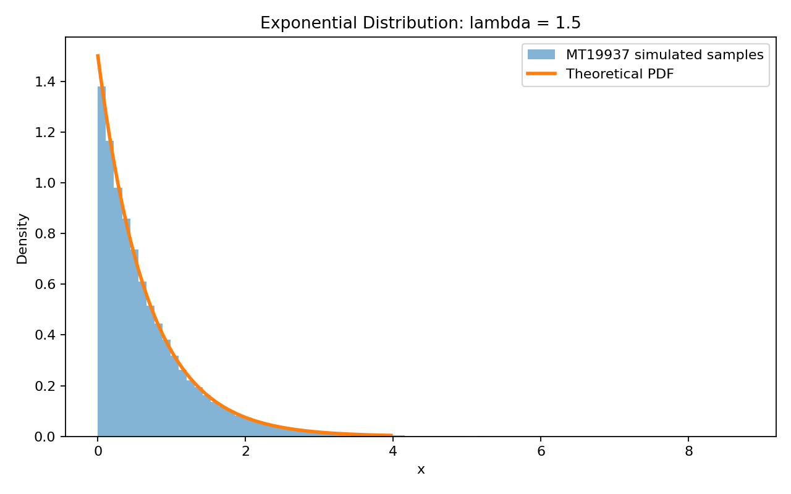
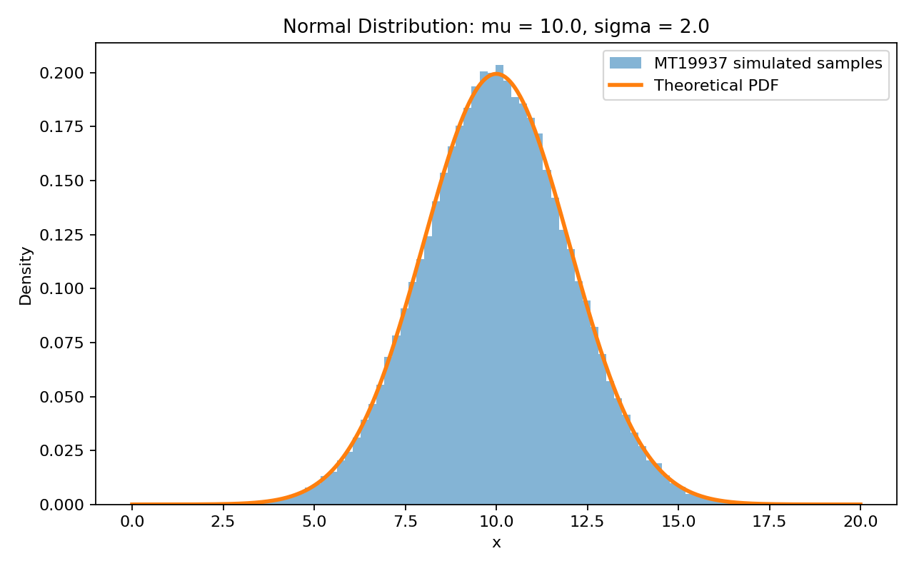
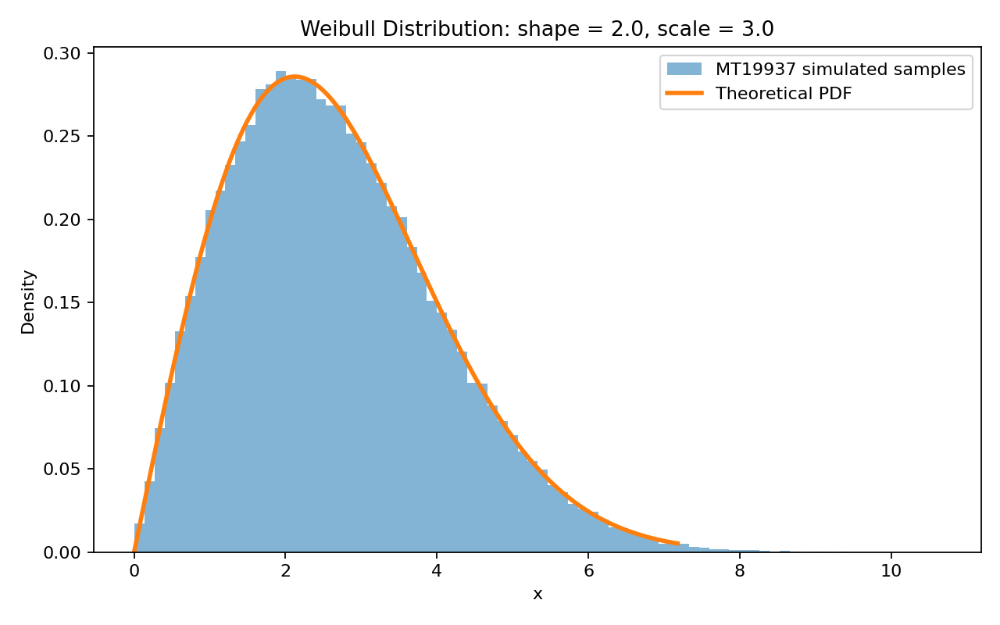

# Report: Random Number Generation Using MT19937

## 1. Background and Motivation

Random numbers are required in simulation, statistical inference, machine learning, optimization, randomized algorithms, and uncertainty analysis. In software, these values are usually pseudorandom rather than truly random. A pseudorandom number generator starts from a seed and then follows a deterministic algorithm to produce a long sequence that behaves like random data for practical statistical purposes.

This study focuses on MT19937, also known as the Mersenne Twister. The goal is to use MT19937 as the source of base uniform random numbers and then transform those uniform values into samples from three probability distributions:

1. Exponential distribution, Exp(lambda)
2. Normal distribution, N(mu, sigma^2)
3. Weibull distribution, selected as an additional distribution because of its relevance to reliability and lifetime modeling

The main reason for solving this problem is to connect two ideas: how pseudorandom uniform numbers are generated, and how those uniform values become non-uniform random variables through mathematically justified transformations.

---

## 2. Understanding of the Problem

The problem has two parts.

First, MT19937 must be discussed as a uniform pseudorandom number generator. This includes its features, period length, efficiency, applications, and limitations. It also requires comparing MT19937 with simpler generators such as linear congruential generators and with hardware-based generators.

Second, MT19937-generated uniform random values must be transformed into samples from exponential, normal, and one additional distribution. For each distribution, the transformation must be explained mathematically, implemented in source code, visualized using normalized histograms, and compared with the theoretical probability density function.

The important point is that the output should not only show numerical results. It should explain why the method works and whether the simulated samples behave consistently with the target theoretical distributions.

---

## 3. Methodology

### 3.1 Uniform Random Numbers from MT19937

The script uses NumPy's `MT19937` bit generator through the modern `Generator` interface:

```python
bit_generator = np.random.MT19937(seed=SEED)
rng = np.random.Generator(bit_generator)
```

A fixed seed is used:

```text
seed = 212
```

The fixed seed makes the results reproducible. Reproducibility is useful because the same plots and numerical summaries can be regenerated for checking, grading, or future comparison.

The sample size is:

```text
n = 100,000
```

This is large enough for the simulated histograms to show the expected distribution shapes clearly while still being fast to compute.

### 3.2 Why Transform Uniform Random Numbers?

Most random variate generation starts from a base source of U(0,1) random variables. If a distribution has cumulative distribution function F(x), then the inverse transform principle says:

```text
If U ~ Uniform(0,1), then X = F^(-1)(U) has CDF F.
```

This works because:

```text
P(X <= x) = P(F^(-1)(U) <= x)
          = P(U <= F(x))
          = F(x)
```

when F is monotone and invertible. This method is used for the exponential and Weibull distributions. For the normal distribution, the Box-Muller transform is used because the normal inverse CDF is not as simple to express in elementary closed form.

---

## 4. MT19937 Discussion

### 4.1 What is MT19937?

MT19937 is a Mersenne Twister pseudorandom number generator introduced by Matsumoto and Nishimura. The number 19937 refers to the Mersenne prime exponent used in its design.

Its period is:

```text
2^19937 - 1
```

This period is extremely large, so repetition is not a practical concern for ordinary simulations.

### 4.2 Features

MT19937 has several important features:

- Very long period: 2^19937 - 1
- Good equidistribution properties, including 623-dimensional equidistribution for 32-bit accuracy
- Fast software generation of pseudorandom values
- Deterministic reproducibility when the seed is fixed
- Wide availability in scientific computing environments

These properties make MT19937 suitable for many simulation and teaching tasks.

### 4.3 Efficiency Compared with LCGs

A linear congruential generator has the form:

```text
X_(n+1) = (aX_n + c) mod m
```

LCGs are simple, fast, and memory-efficient. However, poor parameter choices can cause short periods and visible lattice patterns, especially in higher-dimensional simulations. MT19937 uses a much larger state and has a far longer period than simple LCGs. This makes MT19937 generally more reliable for large statistical simulations.

The tradeoff is that MT19937 is more complex and uses more memory than a small LCG. For very small embedded systems, an LCG may still be attractive because of its simplicity. For scientific computing, MT19937 is usually the stronger choice.

### 4.4 Comparison with Hardware-Based Generators

Hardware random number generators obtain randomness from physical processes such as thermal noise, electronic noise, or quantum effects. They can provide non-deterministic random bits, which are useful when unpredictability is required.

MT19937 is deterministic. This is a weakness for security but a strength for simulation. If a seed is fixed, another person can exactly reproduce the sequence. Hardware-based generators are better for cryptographic keys and security-sensitive randomness, while MT19937 is better for reproducible experiments.

### 4.5 Applications and Limitations

MT19937 is commonly used in:

- Monte Carlo simulation
- Statistical experiments
- Bootstrapping
- Teaching probability and simulation
- Randomized algorithms
- Games and procedural generation

Its main limitation is that it is not cryptographically secure. If enough outputs are observed, the internal state can be reconstructed and future outputs can be predicted. Therefore, MT19937 should not be used for passwords, secret tokens, cryptographic keys, or security-sensitive systems.

---

## 5. Distribution 1: Exponential(lambda)

### 5.1 Background

The exponential distribution is commonly used to model waiting times between independent events, such as arrivals in a queue or the lifetime of a component under a constant hazard rate.

### 5.2 Parameters

```text
lambda = 1.5
```

The theoretical mean and variance are:

```text
E[X] = 1 / lambda = 0.6667
Var(X) = 1 / lambda^2 = 0.4444
```

### 5.3 Method of Solution

For X ~ Exp(lambda), the CDF is:

```text
F(x) = 1 - exp(-lambda x), x >= 0
```

Set U = F(X):

```text
U = 1 - exp(-lambda X)
exp(-lambda X) = 1 - U
-lambda X = ln(1 - U)
X = -ln(1 - U) / lambda
```

Therefore, the transformation used is:

```text
X = -ln(1 - U) / lambda
```

Since 1 - U is also uniform on (0,1), the equivalent expression `-ln(U) / lambda` is also commonly used.

### 5.4 Observations

The exponential histogram has its highest density near zero and decreases as x increases. This matches the theoretical exponential PDF. The right tail is visible, but the far tail has fewer observations, so small visual deviations are expected there.



---

## 6. Distribution 2: Normal(mu, sigma^2)

### 6.1 Background

The normal distribution is central in statistics because it appears in measurement error, noise models, and the Central Limit Theorem. It is also a common modeling assumption in inference and machine learning.

### 6.2 Parameters

```text
mu = 10
sigma = 2
sigma^2 = 4
```

### 6.3 Method of Solution

The Box-Muller transform converts two independent uniform random variables into a standard normal random variable.

Let:

```text
U1, U2 ~ Uniform(0,1), independent
```

Then:

```text
Z = sqrt(-2 ln U1) cos(2 pi U2)
```

has the standard normal distribution N(0,1). To shift and scale the result:

```text
X = mu + sigma Z
```

so that:

```text
X ~ N(mu, sigma^2)
```

### 6.4 Observations

The generated normal histogram is symmetric and centered near 10. The theoretical PDF overlays the empirical density closely. The tails have more variability than the center because extreme values occur less often.



---

## 7. Distribution 3: Weibull(shape, scale)

### 7.1 Background and Motivation

The Weibull distribution is useful in reliability analysis, survival analysis, and engineering failure-time modeling. It is flexible because its shape parameter can represent increasing, decreasing, or constant failure rates.

### 7.2 Parameters

```text
shape k = 2
scale eta = 3
```

For k = 2, the Weibull distribution is unimodal and right-skewed.

### 7.3 Method of Solution

For X ~ Weibull(k, eta), the CDF is:

```text
F(x) = 1 - exp[-(x / eta)^k], x >= 0
```

Set U = F(X):

```text
U = 1 - exp[-(X / eta)^k]
exp[-(X / eta)^k] = 1 - U
-(X / eta)^k = ln(1 - U)
(X / eta)^k = -ln(1 - U)
X = eta[-ln(1 - U)]^(1 / k)
```

Therefore, the transformation used is:

```text
X = eta[-ln(1 - U)]^(1 / k)
```

The theoretical mean and variance are:

```text
E[X] = eta Gamma(1 + 1/k)
Var(X) = eta^2 [Gamma(1 + 2/k) - Gamma(1 + 1/k)^2]
```

### 7.4 Observations

The Weibull histogram starts near zero, rises to a peak, and then decreases with a right tail. This shape agrees with the theoretical PDF for k = 2 and eta = 3. The match is strong in the main body of the distribution, while the far right tail is naturally noisier.



---

## 8. Snapshots of the Solution

The implementation follows these main steps:

1. Initialize MT19937 with a fixed seed.
2. Generate independent U(0,1) samples.
3. Transform uniform samples into exponential samples using inverse transform sampling.
4. Transform two uniform samples into normal samples using the Box-Muller method.
5. Transform uniform samples into Weibull samples using inverse transform sampling.
6. Compute sample summaries.
7. Plot normalized histograms.
8. Overlay theoretical PDFs.
9. Compare empirical and theoretical values.

Key implementation snapshot:

```python
bit_generator = np.random.MT19937(seed=SEED)
rng = np.random.Generator(bit_generator)

U_exp = rng.random(N)
U_norm1 = rng.random(N)
U_norm2 = rng.random(N)
U_weibull = rng.random(N)

X_exp = -np.log(1.0 - U_exp) / lambda_exp
Z = np.sqrt(-2.0 * np.log(U_norm1)) * np.cos(2.0 * np.pi * U_norm2)
X_norm = mu + sigma * Z
X_weibull = eta_scale * (-np.log(1.0 - U_weibull)) ** (1.0 / k_shape)
```

The plots generated by the source code are stored in:

- `mt19937_output/exponential_mt19937.png`
- `mt19937_output/normal_mt19937.png`
- `mt19937_output/weibull_mt19937.png`

---

## 9. Results, Tables, and Analysis

The script was run with seed 212 and n = 100,000 samples for each distribution.

| Distribution | Sample Mean | Theoretical Mean | Absolute Mean Error | Sample Variance | Theoretical Variance | Absolute Variance Error |
| --- | ---: | ---: | ---: | ---: | ---: | ---: |
| Exponential(lambda = 1.5) | 0.666245 | 0.666667 | 0.000422 | 0.445389 | 0.444444 | 0.000945 |
| Normal(mu = 10, sigma = 2) | 10.002812 | 10.000000 | 0.002812 | 3.999812 | 4.000000 | 0.000188 |
| Weibull(k = 2, eta = 3) | 2.657507 | 2.658681 | 0.001174 | 1.925611 | 1.931417 | 0.005806 |

Additional sample ranges:

| Distribution | Minimum | Maximum |
| --- | ---: | ---: |
| Exponential(lambda = 1.5) | 0.000001 | 8.747745 |
| Normal(mu = 10, sigma = 2) | 0.611351 | 18.033113 |
| Weibull(k = 2, eta = 3) | 0.006511 | 10.656701 |

The sample means and variances are very close to their theoretical values. This indicates that the transformations are working correctly and that MT19937 is providing uniform values that are adequate for this simulation.

The histograms also support this conclusion. The exponential sample is strongly right-skewed, the normal sample is bell-shaped and centered near 10, and the Weibull sample is unimodal with a right tail. These visual patterns match the theoretical PDFs.

---

## 10. Discussion of Discrepancies

The simulated histograms do not match the theoretical PDFs perfectly. The main reasons are:

1. Finite sample size  
   Even 100,000 samples are still only a finite approximation to a continuous distribution.

2. Histogram binning  
   The choice of 80 bins affects the appearance of the empirical density. More bins can make the histogram look noisier, while fewer bins can hide detail.

3. Tail sparsity  
   Extreme observations are rare, so the tails have more visual variability than the center of each distribution.

4. Pseudorandomness  
   MT19937 is deterministic and pseudorandom. It has strong simulation properties, but it is not a source of true physical randomness.

5. Floating-point precision  
   The transformations use logarithms, square roots, trigonometric functions, and floating-point arithmetic. Very small numerical differences are expected.

Overall, the discrepancies are small and consistent with normal simulation error. Increasing the sample size would generally make the empirical histograms closer to the theoretical PDFs.

---

## 11. Conclusion

MT19937 is a strong pseudorandom number generator for simulation and scientific computing. Its long period, speed, reproducibility, and equidistribution properties make it more suitable for large simulations than simple linear congruential generators. However, it is deterministic and not cryptographically secure, so it should not be used for security-sensitive randomness.

The computational results show that MT19937-generated uniform random numbers can be successfully transformed into exponential, normal, and Weibull samples. The inverse transform method works directly for the exponential and Weibull distributions because their CDFs can be inverted. The Box-Muller method provides a direct transformation for generating normal random variables from two independent uniforms.

The numerical summaries and plots both show strong agreement between the simulated samples and their theoretical distributions. Remaining differences are explained by finite sampling, histogram binning, tail sparsity, pseudorandomness, and floating-point precision.

---

## 12. Source Code and Reproducibility

The source code is in:

```text
mt19937_rng_study.py
```

Run it from the deliverables folder with:

```text
python3 mt19937_rng_study.py
```

The code is documented with comments explaining the seed, MT19937 setup, uniform sample generation, distribution transformations, PDF definitions, plotting, and summary statistics.

---

## 13. References

- Matsumoto, M. and Nishimura, T. (1998). Mersenne Twister: A 623-dimensionally equidistributed uniform pseudo-random number generator.
- NumPy documentation: MT19937 Bit Generator.
- NIST SP 800-90A: Recommendation for Random Number Generation Using Deterministic Random Bit Generators.
- NIST SP 800-90B: Recommendation for the Entropy Sources Used for Random Bit Generation.
